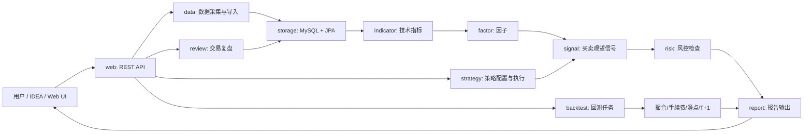

# Architecture

> ⚠️ Historical（历史参考，非当前执行入口）。当前事实以 AI_HANDOFF.md + development/DEVELOPMENT_LOG.md + CURRENT_ARCHITECTURE_AND_MODULES.md 为准；新会话入口见 AI_DEVELOPMENT_INDEX.md。

## 系统定位

`quant-trading-assistant` 是本地优先、可服务器部署的交易辅助后端。它的核心价值不是预测神奇买点，而是建立一套可验证、可复盘、可风控的数据流程。

## 总体架构



## 模块说明

| 模块 | 职责 | v0.1 范围 |
| --- | --- | --- |
| `data` | 数据源适配、CSV 导入、行情更新 | 手工 CSV 导入日 K |
| `storage` | Entity、Repository、数据库访问 | MySQL + JPA |
| `indicator` | 技术指标计算 | MA、MACD、RSI、BOLL、成交量 |
| `factor` | 可复用特征 | 趋势、波动率、量价关系 |
| `strategy` | 策略规则和配置 | 均线策略、放量突破策略雏形 |
| `signal` | 买入/卖出/观望信号 | 持久化信号和解释理由 |
| `risk` | 仓位、止损、风险提示 | 单票上限、止损线、连续失败降仓 |
| `backtest` | 历史回测 | 日线事件驱动简化回测 |
| `portfolio` | 持仓和资金快照 | 手工录入持仓 |
| `review` | 交易日志和复盘 | 记录买卖原因、结果、复盘 |
| `report` | 输出报告 | JSON 报告，后续可加 HTML |
| `web` | REST API | 后端接口 |
| `scheduler` | 定时任务 | 后续再做 |
| `config` | 配置管理 | Spring profiles 和配置属性 |

## 推荐包结构

```text
src/main/java/com/quant/trade
├── QuantTradingAssistantApplication.java
├── common
├── config
├── data
├── storage
├── indicator
├── factor
├── strategy
├── signal
├── risk
├── backtest
├── portfolio
├── review
├── report
├── scheduler
└── web
```

## 数据流

```text
CSV/API 数据源
-> data import
-> stock_daily_bar / stock_minute_bar
-> indicator calculation
-> technical_indicator_daily
-> strategy execution
-> strategy_signal
-> risk check
-> risk_alert
-> report/review
```

## 策略流

```text
StrategyConfig
-> load market data
-> calculate indicators
-> generate raw signal
-> risk filter
-> final signal
-> persist reason and snapshot
```

## 回测流

```text
BacktestTask
-> load historical bars
-> initialize account
-> iterate by trading date
-> update indicators
-> strategy generates orders
-> risk check
-> simulate matching
-> apply commission/slippage/T+1/limit-up-limit-down
-> update positions/cash/equity
-> output metrics and trades
```

## 部署形态

v0.1：

- Spring Boot 单体。
- MySQL 单实例。
- Docker Compose 本地启动。

后续：

- 前端单独容器。
- Python 指标/回测实验服务作为可选 adapter。
- 定时任务可拆为 worker，但不要过早微服务化。
