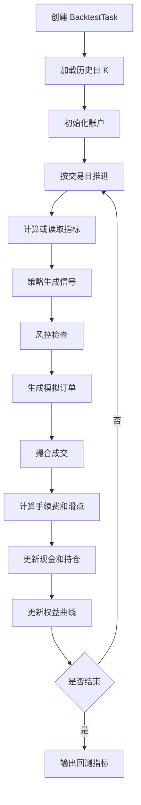

# Backtest Engine Design

> ⚠️ Historical（历史参考，非当前执行入口）。当前事实以 AI_HANDOFF.md + development/DEVELOPMENT_LOG.md + CURRENT_ARCHITECTURE_AND_MODULES.md 为准；新会话入口见 AI_DEVELOPMENT_INDEX.md。

## v0.1 回测目标

先实现一个日线级别、单体内运行的简化事件驱动回测引擎，用来验证策略规则是否大致合理。

## 核心流程



## 核心类草案

```text
backtest
├── BacktestEngine
├── BacktestTaskCommand
├── BacktestContext
├── BacktestAccount
├── BacktestPosition
├── SimulatedOrder
├── SimulatedTrade
├── MatchingEngine
├── CommissionCalculator
├── SlippageModel
├── EquityCurvePoint
└── BacktestMetricsCalculator
```

## 关键规则

### 手续费

第一版可以配置：

```text
commission = trade_amount * commission_rate
```

A 股可以后续补：

- 买入佣金。
- 卖出佣金。
- 印花税。
- 最低佣金。

### 滑点

第一版可以配置：

```text
buy_fill_price = close_price * (1 + slippage_rate)
sell_fill_price = close_price * (1 - slippage_rate)
```

### A 股 T+1

简化规则：

- 当天买入的仓位当天不可卖。
- 持仓记录需要区分 `available_quantity` 和 `total_quantity`。
- 每个新交易日开始时，把昨日买入仓位转为可卖。

### 涨跌停

简化规则：

- 涨停日不允许买入成交，除非模拟排队成交。
- 跌停日不允许卖出成交，除非模拟排队成交。
- 第一版可以直接拒绝对应方向成交，并记录原因。

## 回测指标

v0.1 至少输出：

- total_return
- max_drawdown
- win_rate
- profit_loss_ratio
- trade_count
- average_win
- average_loss
- final_equity

## 回测陷阱

- 未来函数：不能用当日收盘后才知道的信息在当日开盘买入。
- 手续费缺失：会显著高估短线策略。
- 滑点缺失：会高估突破、追涨和做 T 策略。
- 成交量限制缺失：小成交量股票无法无限成交。
- T+1 忽略：A 股当天买入不能当天卖出。
- 涨跌停忽略：涨停未必买得到，跌停未必卖得出。
- 参数过拟合：回测好看不代表未来可用。

## 推荐实现顺序

1. 先实现只买一只股票的回测。
2. 再实现多股票循环。
3. 再实现手续费和滑点。
4. 再实现 T+1。
5. 再实现涨跌停。
6. 最后再做参数优化。
