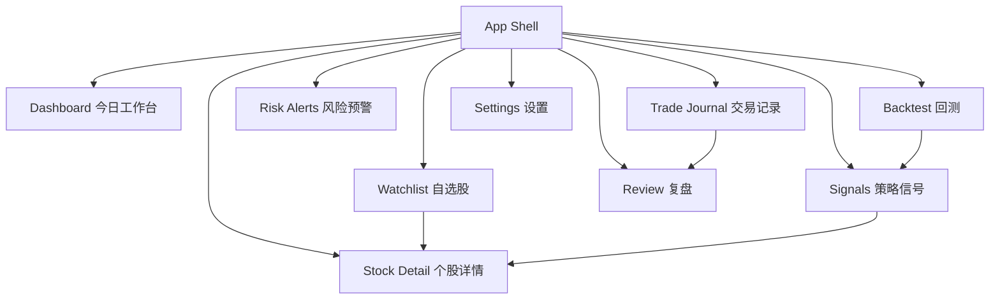

# Frontend Architecture

## 结论

前端建议单独建一个项目：

```text
/Users/joker/code/quant-trading-assistant      # Java Spring Boot 后端
/Users/joker/code/quant-trading-assistant-web  # 前端项目
```

整体采用前后端分离：

```text
Browser
  -> React/Vite Frontend
  -> REST API
  -> Spring Boot Backend
  -> MySQL
```

当前目标不是做一个漂亮官网，而是做一个能在交易日使用的本地工作台：快速记录、快速查看、快速复盘。

## 推荐技术栈

| 层 | 推荐 | 理由 |
| --- | --- | --- |
| 构建工具 | Vite | 本地启动快，AI 生成代码容易维护 |
| 框架 | React + TypeScript | 生态成熟，表格、图表、状态管理资料多 |
| UI 组件 | Ant Design | 适合后台、表格、表单、筛选器、弹窗 |
| 路由 | React Router | 页面清晰，学习成本低 |
| 服务端状态 | TanStack Query | 管理 API 请求、缓存、刷新、错误状态 |
| 本地状态 | Zustand | 简单管理全局偏好、当前股票、筛选条件 |
| 图表 | ECharts | K 线、成交量、指标副图、资金曲线都适合 |
| HTTP 客户端 | Axios | 简单直接，后续可替换为 OpenAPI generated client |
| 日期处理 | dayjs | 轻量，适合交易日期 |
| 表单校验 | Ant Design Form + zod 可选 | v0.1 先简单，复杂表单再加 zod |

不建议 v0.1 使用：

- Next.js：当前不是内容站，也不需要 SSR。
- 微前端：过早复杂化。
- 大型低代码平台：后续可评估，但初期会拖慢核心闭环。
- 复杂状态机：策略和回测状态先放后端。

## 产品定位

前端是个人交易工作台，核心任务：

- 盘前：查看自选股、昨日信号、风险提示。
- 盘中：快速记录观察、计划、临时想法。
- 盘后：补录真实交易、复盘原因、对照信号和结果。
- 周末：查看回测、统计错误类型、优化规则。

## v0.1 页面结构

```text
quant-trading-assistant-web
├── Dashboard              # 今日工作台
├── Watchlist              # 自选股
├── StockDetail            # 个股详情
├── DataImport             # 数据导入
├── Signals                # 策略信号
├── Backtest               # 回测任务和结果
├── RiskAlerts             # 风险预警
├── TradeJournal           # 交易记录
├── Review                 # 复盘笔记
└── Settings               # 本地配置
```

## 页面优先级

### 1. Dashboard

今天最应该先做的页面。

展示：

- 今日日期和市场状态占位。
- 自选股数量。
- 今日信号数量。
- 高风险预警数量。
- 待复盘交易数量。
- 快捷入口：新增自选股、记录交易、写复盘、导入数据。

v0.1 可以先用 mock 数据和 localStorage，后端 API 完成后再切真实接口。

### 2. Watchlist

下周边炒股边记录时最有用。

字段：

- 股票代码
- 股票名称
- 分组
- 关注理由
- 交易风格：短线 / 做 T / 波段 / 观察
- 风险备注
- 是否启用
- 更新时间

操作：

- 新增自选股
- 编辑关注理由
- 停用
- 跳转个股详情

### 3. TradeJournal

这是你形成规则体系的核心页面。

字段：

- 股票代码
- 交易日期
- 买/卖
- 价格
- 数量
- 仓位比例
- 买卖理由
- 计划止损
- 计划止盈
- 实际结果
- 错误标签：追高、恐慌卖、未止损、仓位过重、无计划交易

### 4. Review

复盘页面不追求复杂，先保证你每天能写下来。

字段：

- 日期
- 股票代码
- 市场环境
- 当时计划
- 实际操作
- 做对了什么
- 做错了什么
- 下一次规则修正

### 5. StockDetail

个股详情页用于把数据、指标、信号、复盘连起来。

区域：

- 顶部：股票基础信息和当前关注状态。
- 主图：K 线 + MA。
- 副图：MACD / RSI / 成交量。
- 右侧：最新信号和风险提示。
- 底部：交易记录和复盘记录。

### 6. Backtest

v0.1 只需要能提交任务和看摘要。

字段：

- 策略
- 股票范围
- 开始日期
- 结束日期
- 初始资金
- 手续费
- 滑点

结果：

- 总收益
- 最大回撤
- 胜率
- 盈亏比
- 交易次数
- 资金曲线

## 信息架构



## 推荐交互布局

使用后台式布局：

```text
┌─────────────────────────────────────────────┐
│ TopBar: 项目名 / 当前日期 / 数据状态 / 设置 │
├─────────────┬───────────────────────────────┤
│ Sidebar     │ Main Content                  │
│ Dashboard   │                               │
│ Watchlist   │                               │
│ Signals     │                               │
│ Backtest    │                               │
│ Journal     │                               │
│ Review      │                               │
│ Settings    │                               │
└─────────────┴───────────────────────────────┘
```

设计原则：

- 信息密度高一点，适合每天反复使用。
- 不做大 hero，不做营销页。
- 表格、筛选、抽屉、弹窗优先。
- 买卖信号不能用刺激性文案，统一叫“辅助信号”。
- 风险提示永远和信号一起出现。

## 前端目录设计

```text
quant-trading-assistant-web
├── Dockerfile
├── nginx.conf
├── package.json
├── vite.config.ts
├── src
│   ├── main.tsx
│   ├── App.tsx
│   ├── app
│   │   ├── router.tsx
│   │   ├── providers.tsx
│   │   └── layout
│   │       ├── AppLayout.tsx
│   │       ├── Sidebar.tsx
│   │       └── TopBar.tsx
│   ├── api
│   │   ├── http.ts
│   │   ├── watchlistApi.ts
│   │   ├── journalApi.ts
│   │   ├── signalApi.ts
│   │   ├── backtestApi.ts
│   │   └── mock
│   ├── pages
│   │   ├── dashboard
│   │   ├── watchlist
│   │   ├── stock-detail
│   │   ├── signals
│   │   ├── backtest
│   │   ├── risk-alerts
│   │   ├── trade-journal
│   │   ├── review
│   │   └── settings
│   ├── components
│   │   ├── charts
│   │   ├── forms
│   │   ├── tables
│   │   └── common
│   ├── types
│   ├── stores
│   ├── hooks
│   ├── utils
│   └── styles
└── README.md
```

## 前后端接口边界

前端只通过 REST API 调用后端，不直接访问数据库。

基础路径建议：

```text
GET    /api/health
GET    /api/watchlist
POST   /api/watchlist
PUT    /api/watchlist/{id}
DELETE /api/watchlist/{id}

POST   /api/daily-bars/import
GET    /api/stocks/{symbol}/daily-bars
GET    /api/stocks/{symbol}/indicators

GET    /api/signals
POST   /api/signals/run

POST   /api/backtests
GET    /api/backtests
GET    /api/backtests/{id}

GET    /api/risk-alerts
POST   /api/trade-journals
GET    /api/trade-journals
POST   /api/review-notes
GET    /api/review-notes
```

统一响应建议：

```json
{
  "success": true,
  "data": {},
  "message": null,
  "timestamp": "2026-06-07T20:00:00+08:00"
}
```

## Mock 优先策略

为了今天跑出雏形，前端先支持 mock 模式：

```text
VITE_API_MODE=mock
```

mock 模式：

- Dashboard 使用本地 mock 数据。
- Watchlist 可以先用 localStorage。
- TradeJournal 和 Review 可以先用 localStorage。
- Backtest 和 Signals 先展示假数据结构。

真实 API 模式：

```text
VITE_API_MODE=remote
VITE_API_BASE_URL=http://localhost:8080
```

这样即使后端业务 API 还没写完，前端今天也能跑起来，下周可以先记录自选股、交易和复盘。

## 前端状态设计

### 服务端状态

使用 TanStack Query 管：

- 自选股列表
- 信号列表
- 回测任务
- 风险预警
- 复盘记录

### 本地状态

使用 Zustand 管：

- 当前选中的股票
- 侧边栏折叠状态
- 当前交易日期
- mock/remote 模式提示
- 页面筛选条件

### 表单状态

使用 Ant Design Form。

## 今天可跑雏形范围

今天不要追求完整前端，只做这个最小集：

```text
Vite React App
-> AppLayout
-> Dashboard
-> Watchlist with localStorage
-> TradeJournal with localStorage
-> Review with localStorage
-> Settings
```

验收标准：

- `npm run dev` 能启动。
- 首页能看到工作台。
- 能新增自选股。
- 能新增一条交易记录。
- 能新增一条复盘。
- 刷新页面后 localStorage 数据不丢。
- 页面上明确显示“辅助记录，不自动交易”。

## 下周边交易边记录的工作流

盘前：

1. 打开 Dashboard。
2. 查看自选股。
3. 给每只关注股票写计划：支撑位、压力位、止损位。

盘中：

1. 不需要系统自动下单。
2. 如果手动买卖，立刻在 TradeJournal 记录理由。
3. 临时观察写到 Review 草稿或个股备注。

盘后：

1. 补完整交易结果。
2. 给每笔交易打错误标签。
3. 对比系统信号和真实操作。
4. 修改下一次交易规则。

## Docker 部署

前端 Docker 推荐：

```text
frontend build
-> nginx static files
-> /api proxy to backend
```

服务器部署形态：

```text
docker compose
├── qta-frontend  # nginx + static frontend
├── qta-server    # Spring Boot
└── qta-mysql     # MySQL 8.4
```

本地开发：

```text
frontend: http://localhost:5173
backend:  http://localhost:8080
mysql:    localhost:3306
```

服务器生产：

```text
frontend: http://your-server
backend:  internal qta-server:8080
mysql:    internal qta-mysql:3306
```

## 后续扩展

v0.2：

- 接真实后端 API。
- 引入 K 线图和指标图。
- 支持 CSV 上传。
- 支持信号列表和风险预警。

v1.0：

- OpenAPI 自动生成 TypeScript API client。
- 用户配置备份。
- 多策略回测对比。
- 自动日报/周报。
- Docker Compose 一键部署。

## 给 AI 的前端开发提示词

```text
请创建一个新的前端项目 quant-trading-assistant-web。

技术栈：
- Vite
- React
- TypeScript
- Ant Design
- React Router
- TanStack Query
- Zustand
- ECharts
- Axios
- dayjs

请先阅读后端仓库中的 docs/FRONTEND_ARCHITECTURE.md。

目标是今天跑出最小雏形：
1. AppLayout：左侧菜单 + 顶部栏；
2. Dashboard：显示今日工作台；
3. Watchlist：支持 localStorage 新增/编辑/删除自选股；
4. TradeJournal：支持 localStorage 记录交易；
5. Review：支持 localStorage 写盘后复盘；
6. Settings：显示 API 模式和后端地址配置；
7. 所有页面都明确这是交易辅助记录系统，不自动交易；
8. 先使用 mock/localStorage，不等待后端业务 API。

请保证：
- npm install 后能 npm run dev；
- 页面适合桌面端交易工作台；
- 不做营销页，不做 hero；
- 不要接券商，不要处理真实密钥，不要自动下单。
```
