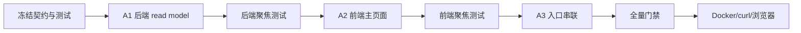

# P1.9-A 行情数据详情实施计划

> 输入：`../features/MARKET_DATA_ASSET_CENTER_DESIGN.md`
>
> 状态：冻结，可交给实施者。只实施 P1.9-A，不实施 P1.9-B/C、P1.7 或 P2 指标。
>
> 产品定位受 ADR-0013 修订：本计划只交付数据检查和质量追溯能力，不把 `/market-assets` 建成市场研究首页。P1.9-B/C 分别并入 P1.10 板块详情和候选扫描。

## 1. 基线与边界

- 后端基线：当前 `main`。
- 前端基线：当前 `main`。
- 跨仓任务使用同名任务分支 `codex/market-data-asset-center-p19a`。
- 后端只读复用现有行情表，不新增 Flyway migration。
- 前端允许新增并锁定 `lightweight-charts` 5.2.x 依赖，保留 attribution。
- 不触碰交易、持仓、风控、OpenClaw、P1.7 计算或采集 scheduler。

## 2. 实施切片

### A1：后端 availability 与 series read model

目标：前端一次请求获得绘图、摘要、质量和水位所需数据。

预期范围：

- `marketdata.asset` controller/service/manager/dto/vo/convert。
- 复用或扩展 daily/minute/quote/watermark/stock mapper 与 XML 的有界查询。
- availability、series、related-tasks 三个只读端点。
- 参数、时间范围、时区、来源/复权隔离、2000 bars 限制。
- 单元测试、Controller 测试、Mapper/H2 测试。

停止条件：任何需求要求写原始表、调用 provider 或增加 migration，立即 BLOCKED 并退回设计。

### A2：前端行情数据详情页

目标：完成选择、查询、K 线、成交量、摘要、质量和表格。

预期范围：

- `market-assets` feature 与 `/market-assets` page/route；导航名称为“行情数据详情”，归入数据管理。
- `lightweight-charts` Candlestick + volume pane。
- remote/mock adapter、URL 状态、TanStack Query、loading/empty/error/partial。
- availability 驱动粒度/来源/复权选项。
- 前端聚焦测试，包括 chart adapter、URL、过期请求和空/错状态。
- mock 使用虚构证券身份并遵守示例交易日历；不得使用真实证券名称承载合成 K 线，也不在个人工具工作页增加大面积演示水印。
- 摘要金额/成交量使用紧凑单位与完整值 tooltip，桌面和窄屏均有防重叠约束。

### A3：入口串联与验收

目标：从采集结果上下文进入图表，而不是让用户重复输入。

预期范围：

- 行情工作台采集计划“查看数据”。
- 日 K、分钟 K 表格“图表查看”。
- 相关任务展示与返回链接。
- API、Mock、前端架构、建设看板节点和清单同步。
- Docker/curl 与浏览器桌面/窄屏验收。

## 3. 实施顺序



## 4. 必测场景

### 后端

- 证券不存在、组合不存在、空范围、日期倒置、范围超限。
- daily/minute 分支映射正确，时间升序。
- source/adjustType 不混合。
- 2000 返回、2001 判断 truncated，SQL 有界。
- BigDecimal 摘要、firstOpen=0、volume/amount 空值。
- CN 覆盖率、HK/US UNKNOWN。
- SUSPECT 计数、水位和 latestFetchedAt。
- related tasks 只称相关，不声称精确 bar 血缘。

### 前端

- 未选证券、availability empty、range empty、loading/error/retry。
- A/H/US 时区转换和 URL 参数。
- chart adapter OHLC/volume 颜色与排序。
- 查询切换后旧请求不覆盖新请求。
- 图表创建/resize/destroy，attribution 未关闭。
- 摘要、健康、truncated、UNKNOWN 文案。
- mock 只使用虚构证券且不伪造采集记录，remote 不回退 mock。
- 桌面与窄屏无重叠。

## 5. 门禁

后端：

```bash
./mvnw test
./mvnw package
git diff --check main..HEAD
```

前端：

```bash
npm run typecheck
npm run lint
npm run test
npm run build
git diff --check main..HEAD
```

运行验收：

- Docker MySQL 重建并确认 health UP。
- availability、daily series、minute series、空范围、范围超限各一条 curl。
- 浏览器 `/market-assets` 桌面和窄屏；canvas 非空、成交量 pane 可见、控制台 0 error。

## 6. 交付状态

- 实施者最多标 `SELF_CHECKED`。
- 未跑 Docker/浏览器时只能记录 `AUTOMATION_VERIFIED`，不得写 `RUNTIME_VERIFIED/DEPLOYED`。
- 独立验收通过后才能更新建设看板“P1.9-A”为 DELIVERED，并追加最近交付。
- P1.9-B/C 保持 PLANNED。
