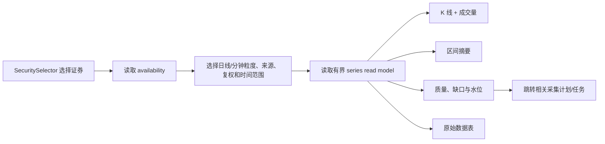
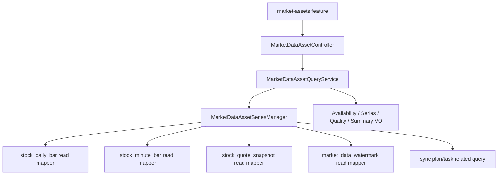

# P1.9 行情数据详情产品与架构设计

> 版本：v1.1
>
> 状态：`DECISION / FROZEN FOR IMPLEMENTATION`
>
> 日期：2026-08-10
>
> 第一实施切片：P1.9-A 个股行情资产查看器。P1.9-B/C 只冻结边界，本轮不得顺带实现。
>
> 2026-08-12 定位修订：本能力是数据资产检查和追溯工具，不是市场发现、板块轮动、候选选股或个股决策首页。上位研究流程见 `MARKET_RESEARCH_DECISION_CENTER_DESIGN.md` 与 ADR-0013。

## 1. 问题与目标

### 1.0 产品定位

- 页面名称调整为“行情数据详情”；现有 `/market-assets` 路由保留兼容。
- 主要入口来自采集计划、数据质量、市场研究页的“查看原始数据”，而不是固定证券演示列表。
- 本页面回答“数据有什么、是否可信、如何追溯”，不回答“市场该看哪里、该研究哪只股票、何时买卖”。
- 市场雷达、板块内候选和个股个人决策上下文统一由 P1.10 设计，不继续往本页堆叠。

### 1.1 当前事实

- 系统已经能够采集并落库 `stock_daily_bar`、`stock_minute_bar`、`stock_quote_snapshot`、采集任务、水位、板块排行和关注板块快照。
- 当前页面把“计划、任务、日 K 表格、分钟 K 表格、水位、板块历史”分散在三个入口。
- 用户能确认任务成功，却不能顺畅回答：数据是什么走势、覆盖哪个区间、是否缺失、来自哪里、最后更新到何时。
- 当前前端没有金融时序图表库，也没有面向图表的有界只读查询契约。

### 1.2 产品目标

让用户从采集计划或证券搜索进入一个统一的数据资产页面，在 30 秒内回答：

1. 这只证券已经有哪些日 K / 分钟 K 数据。
2. 数据覆盖到什么时间，来源和复权口径是什么。
3. 价格与成交量在所选区间如何变化。
4. 数据是否存在缺口、可疑记录、陈旧或截断。
5. 相关采集任务是否成功，下一步应补档还是调整计划。

### 1.3 非目标

- 不新增采集 provider，不直接调用 LongPort，不触发自动采集。
- 不实现 MA/MACD/RSI/BOLL、策略信号、收益预测或回测。
- 不实现 P1.7 板块相对强弱、资金趋势、轮动持续性和异动算法。
- 不把外部行情写入 `portfolio_price_snapshot`，不改变持仓估值口径。
- 不修改或回写任何行情原始事实表。
- 不在第一期做多证券叠加、下载导出、在线编辑或自定义公式。

## 2. 分期范围

| 阶段 | 名称 | 范围 | 本轮状态 |
| --- | --- | --- | --- |
| P1.9-A | 个股行情资产查看器 | 证券选择、可用数据概况、日/分钟 K、成交量、区间摘要、质量与水位、原始表格、任务追溯 | 本轮实施 |
| P1.9-B | 板块历史资产视图 | 历史榜单趋势、选定板块跨批次排名、关注板块聚合/成分历史 | 仅冻结边界 |
| P1.9-C | 对比与导出 | 标准化收益对比、证券/板块对照、CSV 导出、保存视图 | 后置 |

P1.9-A 验收前不得把 P1.9-B/C 标为开发完成。

## 3. 页面入口与用户流程

### 3.1 入口

- 数据管理分组内提供`行情数据详情`入口；在导航分组调整落地前可保留原一级菜单兼容，但不得作为市场研究主入口。
- 新增路由：`/market-assets`。
- URL 可携带：`symbol`、`interval`、`from`、`to`、`source`、`adjustType`。
- 行情工作台采集计划行增加“查看数据”，使用计划首个 symbol、粒度和来源跳转。
- “日 K 数据”和“分钟 K”表格增加“图表查看”，不删除原表格入口。

### 3.2 主流程



### 3.3 页面布局

```text
行情资产  [证券选择器] [日K/1M/5M/15M/30M/60M] [来源] [复权] [日期范围]
数据截至 2026-xx-xx xx:xx  · LONGPORT · NONE · Asia/Shanghai

最新/区间收盘 | 区间涨跌 | 区间最高/最低 | 成交量/成交额 | 实际条数

┌────────────────────────────────────────────────────────────┐
│ K 线主图：十字光标、缩放、拖动、OHLC tooltip              │
├────────────────────────────────────────────────────────────┤
│ 成交量副图：上涨红、下跌绿                                 │
└────────────────────────────────────────────────────────────┘

数据健康：覆盖区间 | 水位 | 实际/预期 | 缺口 | SUSPECT | 截断 | 新鲜度

[原始数据] [相关采集记录]
```

页面是工作型工具，不使用营销 Hero、不嵌套卡片。图表是主视觉，保持稳定高度；摘要和健康状态使用紧凑信息带。

补充布局约束：

- 摘要必须使用紧凑信息带，成交量/成交额按语义使用 `万/亿` 等缩写，tooltip 提供完整值。
- 数字区块必须具备稳定最小宽度和溢出策略；桌面与窄屏不得出现相邻数值、单位或标签重叠。
- 图表 tooltip 必须按容器边界翻转或换行，不能依赖固定宽度和强制不换行。

## 4. P1.9-A 页面行为

### 4.1 证券与数据口径

- 复用共享 `SecuritySelector`，支持 `SH/SZ/BJ/HK/US`。
- 选择证券后先读取 availability，再只展示真正存在的粒度、来源和复权组合。
- 默认组合：优先选择存在数据的 `1D + LONGPORT + NONE`；没有日 K 时选择最新可用分钟粒度。
- 不允许自动混合不同 `dataSource` 或 `adjustType`。切换来源后重新查询并明确显示来源。
- 外部最新价只作页头参考；K 线仍来自日/分钟事实表。
- 页面不得提供绑定真实上市公司的合成行情快捷入口。mock 使用虚构证券代码与名称，并在图表区域持续显示 `LOCAL_DEMO` 水印。

### 4.2 时间范围

- 日 K 快捷范围：1 月、3 月、6 月、1 年、3 年、自定义。
- 分钟 K 快捷范围：当日、近 5 个交易日、近 20 个交易日、自定义。
- 服务端单次最多返回 2000 bars。超限不静默截掉：返回 `truncated=true`、实际范围和建议粒度。
- 1M 自定义最多 5 个交易日；5M 最多 30 个自然日；15M 最多 90 日；30M 最多 180 日；60M 最多 365 日；日 K 最多 10 年。
- 第一版不做服务端降采样；数据过多时提示用户改用更粗粒度。

### 4.3 K 线与成交量

- 采用 `lightweight-charts` 5.2.x，锁定准确版本，不使用手写 canvas/SVG K 线。
- 主 pane 使用 CandlestickSeries，副 pane 使用 HistogramSeries；共享时间轴、十字光标、拖动和缩放。
- 遵循项目既有口径：上涨红、下跌绿；平盘使用中性灰。
- 十字光标 tooltip 展示时间、开高低收、涨跌幅、成交量、成交额、质量状态。
- 初次加载 `fitContent`；切换查询条件后替换数据，不叠加旧序列。
- 容器使用 `ResizeObserver`，卸载时销毁 chart 和订阅，禁止内存泄漏。
- 保留 TradingView attribution logo，不关闭默认归属标识。官方 5.2 支持 Candlestick、Histogram、time scale 和多 pane：
  - https://tradingview.github.io/lightweight-charts/docs/series-types
  - https://tradingview.github.io/lightweight-charts/tutorials/how_to/panes
  - https://tradingview.github.io/lightweight-charts/docs/5.2/api/interfaces/LayoutOptions

### 4.4 区间摘要

所有摘要由后端按本次返回窗口统一计算，前端只格式化：

- `firstOpen`、`lastClose`。
- `absoluteChange = lastClose - firstOpen`。
- `changeRate = absoluteChange / firstOpen`；`firstOpen=0` 时为空。
- `highestHigh`、`lowestLow`。
- `totalVolume`、`totalAmount`。
- `actualBarCount`。

该涨跌是所选数据窗口的价格变化，不是投资收益，不含分红、手续费或持仓成本。

### 4.5 数据健康

必须区分以下状态，不把空数据统一写成“加载失败”：

| 状态 | 页面表达 |
| --- | --- |
| 没有任何组合 | 尚未采集该证券数据，可跳转创建采集计划 |
| 组合存在但范围为空 | 所选范围无记录，可调整范围或补档 |
| `qualityStatus=SUSPECT` | 黄色标记并展示数量，不从图表静默删除 |
| `truncated=true` | 明确提示数据已受上限约束，建议更粗粒度 |
| 数据陈旧 | 展示最后 bar、水位和 fetchedAt，不宣称实时 |
| provider/任务失败 | 在相关采集记录展示错误，不污染已有图表数据 |

覆盖率只在有权威交易日历和交易时段时计算：

- CN 日/分钟可返回 `VERIFIED` 或 `PARTIAL`。
- HK/US 在交易日历未闭环前返回 `UNKNOWN`，不得把周末/节假日误报为缺口。
- `expectedBarCount` 未知时必须为 `null`，不能用实际条数反填。

### 4.6 原始数据与采集追溯

- 原始数据表按时间倒序展示，与图表使用同一响应，避免再次请求产生口径漂移。
- 表格支持时间、OHLC、成交量、成交额、质量、来源、抓取时间。
- “相关采集记录”按 symbol、粒度和时间范围查询相关任务/计划。
- 当前 bar 表没有 `task_id`，因此只能称为“相关采集记录”，不能宣称某一 bar 的精确任务血缘。
- 第一版不为此新增 migration；精确行级血缘若需要，另立数据治理任务。

## 5. 后端只读查询契约

### 5.1 架构决策

新增 `marketdata.asset` 只读查询子模块，复用现有 Mapper/表，不调用 provider、不写数据库、不创建任务。



建议包边界：

```text
com.quant.trade.marketdata.asset
├── controller
├── service
├── manager
├── dto
├── vo
└── convert
```

沿用现有 `marketdata.mapper` 和 XML；只有查询 SQL 缺失时增加方法，不创建平行 DAO 体系。

### 5.2 API

```text
GET /api/v1/market-data/assets/{canonicalSymbol}/availability
GET /api/v1/market-data/assets/{canonicalSymbol}/series
GET /api/v1/market-data/assets/{canonicalSymbol}/related-tasks
```

`series` 参数：

```text
interval=1D|1M|5M|15M|30M|60M
from=ISO date/datetime
to=ISO date/datetime
adjustType=NONE|QF|HF
dataSource=LONGPORT|CSV|MANUAL
```

日期缺失、倒置、范围超限、组合不存在和非法市场时区必须返回稳定业务错误；不得回退到全表查询。

### 5.3 Series 响应

```json
{
  "security": {
    "canonicalSymbol": "SH.600519",
    "displayName": "贵州茅台",
    "market": "SH",
    "currency": "CNY",
    "timeZone": "Asia/Shanghai"
  },
  "query": {
    "interval": "5M",
    "from": "2026-07-17T09:30:00+08:00",
    "to": "2026-07-17T15:00:00+08:00",
    "adjustType": "NONE",
    "dataSource": "LONGPORT"
  },
  "availability": {
    "firstBarTime": "2026-07-17T09:30:00+08:00",
    "lastBarTime": "2026-07-17T14:55:00+08:00",
    "latestFetchedAt": "2026-07-17T15:01:03+08:00",
    "watermarkTime": "2026-07-17T14:55:00+08:00"
  },
  "quality": {
    "coverageStatus": "VERIFIED",
    "actualBarCount": 48,
    "expectedBarCount": 48,
    "missingBarCount": 0,
    "suspectBarCount": 0,
    "truncated": false,
    "reasonCodes": []
  },
  "summary": {
    "firstOpen": "1450.00",
    "lastClose": "1462.00",
    "absoluteChange": "12.00",
    "changeRate": "0.0082758621",
    "highestHigh": "1468.00",
    "lowestLow": "1446.00",
    "totalVolume": 123456,
    "totalAmount": "180000000.00"
  },
  "bars": [
    {
      "time": "2026-07-17T09:30:00+08:00",
      "open": "1450.00",
      "high": "1455.00",
      "low": "1448.00",
      "close": "1453.00",
      "volume": 1000,
      "amount": "1453000.00",
      "qualityStatus": "VALID",
      "fetchedAt": "2026-07-17T15:01:03+08:00"
    }
  ]
}
```

金额和价格继续使用字符串承载 BigDecimal；时间必须带明确 offset，响应 bars 按时间升序。

### 5.4 查询与性能边界

- 查询必须命中 `canonical_symbol + interval/source/adjust + time` 现有索引。
- SQL 必须带时间上下界和 `LIMIT 2001`；第 2001 条只用于判断截断，不返回给前端。
- 禁止先查全量再在 Java 截断。
- 摘要以本次最多 2000 条返回窗口计算，`quality.truncated` 时页面必须显示口径限制。
- availability 使用聚合查询，不加载全部 bars。
- 空数据返回 `200 + bars=[] + availability/quality`，非法参数返回 400，证券不存在返回 404。

## 6. 前端架构

```text
src/features/market-assets/
├── api/marketAssetApi.ts
├── model/types.ts
├── model/chartAdapter.ts
├── hooks/useMarketAssetQuery.ts
├── components/MarketAssetToolbar.tsx
├── components/MarketAssetSummary.tsx
├── components/MarketCandlestickChart.tsx
├── components/MarketAssetHealth.tsx
├── components/MarketAssetTable.tsx
└── components/RelatedCollectionRuns.tsx
src/pages/market-assets.tsx
```

- 页面只编排，业务状态在 feature hook。
- remote 使用新只读 API；mock 使用固定小样本并显著标识 `LOCAL_DEMO`，不得伪造真实采集成功。
- 图表 adapter 单独负责 BigDecimal 字符串、时区和 Lightweight Charts 数据转换。
- URL 查询参数是可分享状态；非法参数回退到安全默认并更新 URL。
- 使用 TanStack Query 缓存；query key 必须包含 symbol/interval/range/source/adjustType/dataMode。
- 不使用 `any`，不在 page/component 直接访问 axios 或 localStorage。

## 7. 状态与异常

- 初始：未选证券，展示证券选择器和最近可用证券入口，不请求 series。
- Loading：工具栏保持稳定，图表区 skeleton 不改变高度。
- Empty：区分“无任何资产”和“所选范围为空”。
- Error：保留当前筛选条件，提供重试；错误消息不暴露 provider 凭据或 SQL。
- Partial/Unknown quality：图表可展示，健康栏降级，不用红色系统错误覆盖图表。
- 切换证券/粒度时取消或忽略过期请求，旧响应不得覆盖新选择。

## 8. 业务与金融边界

- K 线是历史行情事实，不是交易建议。
- 区间涨跌不是用户持仓收益。
- `NONE/QF/HF` 不可混算；HF 若来源不支持则不展示为可选组合。
- 不跨币种合并 amount，不把成交额称为资金净流入。
- 日 K 与分钟 K 不拼接成同一序列。
- SUSPECT 数据保留可见并提示；REJECTED 数据未入库，需通过提醒/任务查看。
- 数据截至时间必须展示，禁止使用“实时”字样，除非明确满足实时口径。

## 9. P1.9-B/C 冻结边界

### P1.9-B 板块历史资产视图

- 本能力并入 P1.10“板块详情”的数据追溯层，不再单独建设与市场雷达竞争的一级页面。
- 排行样本历史：按市场、指标、INTRADAY/CLOSE/MANUAL、日期查看批次和排名；无法证明完整时不得称为全市场。
- 选定板块趋势：跨批次展示 rank、changeRate、指标值和批次质量。
- 关注板块：展示 changeRate、netInflow、turnoverAmount、volume 的历史序列及成分快照。
- 只展示原始历史事实；P1.7 指标未实现前，不显示“相对强弱/轮动/资金趋势评分”。

### P1.9-C 对比与导出

- 多证券比较并入 P1.10“候选扫描”的表格/多图网格；独立保留导出和保存视图能力。
- 多证券比较必须先标准化为起点 100 或区间收益，不能直接叠加不同价格尺度。
- 跨币种只比较无量纲收益，不合并成交额。
- 导出必须携带 symbol、source、adjustType、interval、时区和导出时间。

## 10. P1.9-A 验收标准

1. 用户可从菜单、采集计划、日 K 表和分钟 K 表进入 `/market-assets`。
2. A/H/US 证券选择器可用；availability 只展示真实存在的数据组合。
3. 日 K 与至少一个分钟粒度可绘制 K 线和成交量，切换条件不会残留旧数据。
4. 区间摘要与测试数据的开高低收、涨跌、成交量/额计算一致。
5. 服务端严格执行范围与 2000 bars 上限，不做全表内存截断。
6. 数据健康区正确区分 VERIFIED/PARTIAL/UNKNOWN、缺口、SUSPECT、截断和陈旧。
7. HK/US 日历不完整时不伪造缺口数量。
8. 原始表格和图表使用同一响应；相关任务不冒充行级血缘。
9. mock 明确标识 LOCAL_DEMO，remote 空数据不回退 mock。
10. 图表 attribution 保留，容器 resize 和卸载无泄漏。
11. 后端测试/package、前端 typecheck/lint/test/build 全绿。
12. Docker MySQL 使用一只已有日 K 和一只已有分钟 K 的证券完成 curl；浏览器桌面/窄屏截图确认图表非空、无重叠、控制台无 error。
13. mock 不绑定真实证券身份，不生成周末日 K 或市场交易时段外分钟 K；图表区持续显示演示水印。
14. 页面文案与导航明确其“数据详情/质量追溯”职责，不宣称发现板块、推荐股票或提供买卖点。

## 11. 专业视角审查结论

- 产品视角：优先解决“采集结果不可见”，不提前堆指标。
- 交易员视角：K 线、成交量、数据截至时间、来源、复权和质量必须同屏。
- 量化视角：原始事实与未来衍生指标分层，禁止来源/复权/币种静默混算。
- 数据工程视角：图表使用有界只读 read model，质量未知必须显式表达。
- 架构视角：复用现有表和 Mapper，不新增 migration，不调用 provider，不建立第二套行情存储。
- 前端视角：使用成熟金融图表库，图表 adapter 与页面状态分离，保持响应式和可测试性。

上述结论已冻结。实施者只能在不改变业务语义的范围内做保守技术选择；任何范围、公式、数据混合或完成口径变化必须退回设计阶段。
