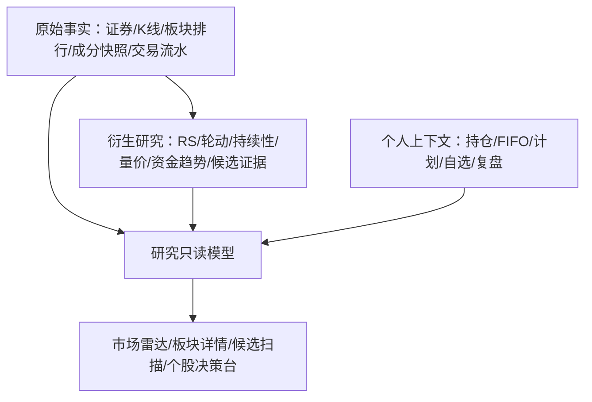

# P1.10 市场研究与个股决策中心产品设计

> 版本：v1.0
>
> 状态：`DECISION / FROZEN FOR IMPLEMENTATION`
>
> 日期：2026-08-12
>
> 上位目标：建立“市场发现 → 板块研判 → 板块内选股 → 个股决策 → 计划与复盘”的完整研究链路。
>
> 关联：`MARKET_SECTOR_ANALYTICS_DESIGN.md`、`MARKET_DATA_ASSET_CENTER_DESIGN.md`、`MARKET_DATA_WORKBENCH_AND_COLLECTION_DESIGN.md`、`TRADE_WORKFLOW_OPTIMIZATION_DESIGN.md`、`../decisions/ADR-0013-research-funnel-and-asset-inspection-boundary.md`。

> 实施快照（2026-08-13）：P1.10-A **前后端候选已实现**，包含稳定板块身份、数据就绪门禁、相对强弱、固定 5 日轮动持续性、原子发布、收盘后自动触发、只读研究 API、市场雷达和板块详情。自动化与 mock 浏览器已通过；真实 Docker/MySQL/provider/remote 页面、真实资金流和 P1.10-B/C 仍未完成。实现契约见 `../api/MARKET_RESEARCH_API.md`。

## 0. 设计结论

### 0.1 当前问题（FACT）

- 当前“行情资产”以一只已知证券为入口，主要回答“有哪些数据、数据是否完整”，不能回答“市场现在该看哪里”。
- 当前板块页面偏采集配置和原始排行，不能直观展示板块强弱如何变化、哪些板块正在改善、哪些只是单日脉冲。
- 当前个股页面只能逐只进入；用户无法在同一屏比较一组候选股票，也看不到自己的真实成交点、计划区间和持仓上下文。
- 当前开发环境可以显示 `LOCAL_DEMO` 合成行情。真实证券名称与规律性合成 K 线同时出现，会让用户误以为数据库行情异常。
- 当前板块排行数据最多只能证明 `RANKED_UNIVERSE`；关注板块资金快照只能证明 `WATCHED_SECTORS`。两者均不得包装成“全市场资金流”。

### 0.2 产品决策（DECISION）

1. 新增上位产品能力“市场研究与个股决策中心”，产品主流程改为：

   ```text
   市场雷达 → 板块详情 → 板块内选股 → 个股决策台 → 自选/计划/交易 → 盘后复盘
   ```

2. “行情资产”降级为数据资产检查工具，不再承担市场发现、选股或交易决策职责。
3. 第一优先级是板块轮动和候选发现，不是继续给单股 K 线堆叠通用技术指标。
4. 研究结果必须提供可解释证据、数据范围和质量状态；第一版不使用黑盒综合分，不输出“推荐买入/卖出”。
5. 个股图上的点分为真实成交点、人工计划点和策略候选点，三者的数据来源、图形和文案必须严格区分。
6. 模拟行情不得继续绑定贵州茅台、腾讯等真实证券名称；演示数据使用虚构代码并在整个图表区持续显示水印。

## 1. 用户问题与成功标准

### 1.1 核心用户问题

| 阶段 | 用户问题 | 产品必须给出的答案 |
| --- | --- | --- |
| 市场发现 | 今天和最近一段时间，市场强势方向在哪里？ | 板块强弱、排名变化、轮动状态、量能/资金证据和数据范围 |
| 板块研判 | 这个板块是持续走强，还是单日脉冲？ | 多窗口相对强弱、持续性、量价确认、排名轨迹和失效原因 |
| 板块内选股 | 这个方向里哪些股票值得进一步研究？ | 可排序候选池、同屏走势、入选原因、流动性和数据质量 |
| 个股决策 | 我对这只股票做过什么计划和交易，现在处于什么位置？ | 真实成交点、持仓成本、止损止盈、计划区间、板块背景和风险状态 |
| 数据追溯 | 这个结论建立在什么数据上，是否可信？ | 数据截至时间、来源、范围、质量、计算版本和原始资产入口 |

### 1.2 可观察成功标准

- 用户打开系统后 15 秒内能识别当前领涨、改善、转弱和落后板块。
- 从市场总览进入任一板块后，30 秒内能得到一组有明确入选原因的候选股票，而不是从固定证券列表盲点。
- 用户可以在一个屏幕内比较至少 6 只、最多 16 只候选股票的统一时间窗口走势。
- 进入个股后，无需切换页面即可看见持仓、真实交易、计划价位、板块环境和数据质量。
- 任一“资金流向”“全市场”“信号”结论都能追溯其 scope、公式、数据时间和失效条件。

## 2. 产品边界

### 2.1 第一阶段做什么

- 建立市场雷达、板块详情、候选股票扫描器和个股决策台四个工作视图。
- 使用已落库原始事实和 P1.7 白盒衍生指标，不在页面加载时临时调用 provider。
- 支持 CN/HK/US 独立市场切换；不同市场不混合排名、不混合交易日、不合并金额。
- 把现有交易计划、交易流水、FIFO 持仓、行情事实和板块上下文组合成只读决策视图。
- 显示明确的降级状态、来源、计算范围、样本规模和更新时间。

### 2.2 第一阶段不做什么

- 不自动下单，不连接交易、账户、订单或真实持仓接口。
- 不输出收益预测、目标收益率、必涨必跌或自动买卖建议。
- 不把 MACD、RSI、BOLL 等通用指标堆满首页；它们属于后续可选研究工具，不是本产品主线。
- 不把成交额、成交量、涨跌幅或相对强弱偷换为资金净流入。
- 不在数据不足时生成完整市场排名、板块成分归因或策略信号。
- 不在第一期建设不可解释的机器学习选股模型。

## 3. 信息架构与导航

### 3.1 一级导航调整

```text
工作台
市场研究
├── 市场雷达              /market-research
├── 板块详情              /market-research/sectors/:sectorId
├── 候选扫描              /market-research/candidates
└── 个股决策台            /market-research/stocks/:canonicalSymbol

交易管理
├── 自选股
├── 交易计划
├── 交易记录
├── 交易账本
├── 持仓快照
└── 盘后复盘

数据管理
├── 行情工作台
├── 板块采集管理
├── 行情数据详情          /market-assets
└── 数据质量与采集任务
```

`行情数据详情`保留现有路由兼容，但不再作为“下一步看什么”的入口。它从个股决策台、采集任务或数据质量状态中按需打开。

### 3.2 决策漏斗


任何页面都必须让用户知道自己处于哪一层、上一层筛选条件是什么，以及如何返回上一级，不形成孤立详情页。

## 4. 页面一：市场雷达

### 4.1 页面任务

市场雷达只回答三个问题：

1. 当前哪些板块相对领先、正在改善、正在转弱或持续落后。
2. 这些状态由排名、相对强弱、量能、资金或宽度中的哪些证据支持。
3. 下一步应该打开哪个板块继续研究。

### 4.2 桌面线框

```text
市场雷达   [CN|HK|US] [收盘] [截至时间] [1日|5日|10日|20日|50日] [刷新]
数据范围：排行样本 / 关注板块 / 全市场已验证   质量：正常/降级/陈旧

┌──────────────────────────────┬───────────────────────────┐
│ 板块热力图                   │ 轮动矩阵                  │
│ 面积：成交额/等权            │ y 相对动量                │
│ 颜色：涨跌/RS/量能           │     改善 → 领先           │
│ 点击进入板块                 │     落后 → 转弱           │
├──────────────────────────────┴───────────────────────────┤
│ 板块排行表：排名 | 1D/5D变化 | RS | 持续性 | 量价 | 资金* │
│ [持续领先] [新近改善] [快速转弱] [放量异动] [数据异常]   │
├──────────────────────────────────────────────────────────┤
│ 今日变化流：新进入头部 / 跌出头部 / 强弱反转 / 数据阻断 │
└──────────────────────────────────────────────────────────┘
```

`资金*`只有在响应明确给出资金口径和 scope 时出现；否则列名改为“活跃度”或隐藏，不保留空壳资金列。

`1日`是独立的当日横截面观察模式：只回答最新收盘批次中哪些板块相对更强、市场涨跌宽度
如何，不展示轮动矩阵、改善/转弱或持续领先等多日结论。多日样本不足时页面允许回退到
`1日强度`，但不得把该结果升级为轮动趋势。

### 4.3 板块热力图

- 面积可切换：`EQUAL`、`TURNOVER_AMOUNT`。没有可比成交额时默认等面积。
- 颜色可切换：当日涨跌、5 日相对强弱、20 日相对强弱、成交活跃度、已验证资金强度。
- 板块按行业分类层级分组；分类版本变化时必须断开历史，不跨 taxonomy 拼接。
- 图例始终可见，明确数值区间、日期和 scope。
- 点击板块进入板块详情；悬浮只显示核心证据，不塞入完整详情。

热力图借鉴成熟市场工具“面积表达权重、颜色表达表现、点击下钻”的模式，但不复制其专有视觉资产。参考：

- TradingView Heatmaps：<https://www.tradingview.com/support/solutions/43000766446-tradingview-heatmaps-from-global-trends-to-details/>

### 4.4 轮动矩阵

轮动矩阵用于识别状态迁移，不用于预测收益。

- 横轴：中期相对强弱水平，例如 20 日 `rsRankPercentile`。
- 纵轴：短期相对强弱变化，例如 5 日 RS 位次变化或标准化相对动量。
- 四个状态：`LEADING` 领先、`IMPROVING` 改善、`WEAKENING` 转弱、`LAGGING` 落后。
- 每个板块显示最近 5～10 个交易日轨迹；轨迹中断必须显示缺数或口径变化原因。
- 象限阈值、窗口和基准必须进入 `parameterHash`，前端不可自行改变公式。

该表现方式借鉴 Relative Rotation Graph 的“相对强弱 + 相对动量 + 历史尾迹”思路；本项目使用自己的白盒指标和术语，不把象限解释为买卖信号。参考：

- StockCharts RRG View：<https://help.stockcharts.com/charts-and-tools/sharpcharts/chartlists/rrg-view>

### 4.5 板块排行表

首屏表格默认展示以下列，允许排序和保存视图：

| 列 | 含义 | 使用边界 |
| --- | --- | --- |
| 当前排名 | 同一批次内位次 | 必须返回总样本数和 scope |
| 排名变化 | 相对前一日/5 日的位次变化 | 身份或样本口径变化时为空 |
| RS 5/20 | 相对共同基准的强弱百分位 | 样本不足时不计算 |
| 持续性 | 头部桶占用率、连续领先天数 | 不等于未来继续上涨概率 |
| 量价状态 | 放量上涨、缩量上涨、放量下跌等六状态 | 必须使用已闭合窗口 |
| 资金状态 | 净流入强度、连续流入天数 | 仅 provider 口径已验证且 scope 可比时出现 |
| 活跃度 | 成交额变化、量比或换手变化 | 不得称为资金流入 |
| 数据质量 | OK/DEGRADED/STALE/INSUFFICIENT | 必须可查看原因 |

默认预设不是“推荐”，而是研究筛选：

- `持续领先`：中期 RS 处于头部且持续性门槛通过。
- `新近改善`：短期位次改善显著，但中期尚未进入领先。
- `快速转弱`：从领先转入弱化，供风险复核。
- `量价异动`：量能或振幅超过白盒阈值。
- `数据异常`：缺失、陈旧、权限阻断或口径变化。

## 5. 页面二：板块详情与候选股票

### 5.1 页面任务

板块详情回答：这个方向为什么值得研究、强势是否持续、板块内部由哪些股票支撑，以及哪些股票值得进入下一层人工研究。

### 5.2 页面线框

```text
半导体  [CN] [当前：IMPROVING] [排行 8/92 ↑12] [数据截至...] [加入关注]
证据：5日RS改善 / 量能放大 / 连续2日排名上升 / 资金口径不可用

┌──────────────────────────────┬───────────────────────────┐
│ 板块走势 vs 共同基准         │ 排名与轮动轨迹            │
│ 标准化起点=100               │ 20日排名带 + 象限迁移     │
├──────────────────────────────┼───────────────────────────┤
│ 量能/成交活跃度              │ 资金趋势（有权限才显示）  │
├──────────────────────────────┴───────────────────────────┤
│ 板块内部候选  [表格|图表网格] [筛选] [排序] [保存视图]    │
│ 股票 | 相对板块强弱 | 量比 | 流动性 | 风险 | 入选原因     │
└──────────────────────────────────────────────────────────┘
```

### 5.3 候选股票范围

候选页面必须展示一个明确的 `candidateScope`：

| scope | 含义 | 页面文案 |
| --- | --- | --- |
| `VERIFIED_SECTOR_UNIVERSE` | 已证明完整的板块成分集合 | 完整板块成分 |
| `WATCHED_SECTOR_MEMBERS` | 关注板块已采集到的成分快照 | 已采集成分，不代表完整板块 |
| `PROVIDER_LEADERS_ONLY` | 只有 provider 返回的领涨标的 | 仅领涨样本 |
| `USER_TRACKED_SYMBOLS` | 用户自选/持仓/计划与板块交集 | 我的跟踪范围 |

第一版不得把 `PROVIDER_LEADERS_ONLY` 或 `WATCHED_SECTOR_MEMBERS` 写成“板块全部股票”。

### 5.4 候选生成规则

候选生成采用“硬门禁 + 可解释排序”，不使用黑盒总分。

硬门禁：

- 证券身份和板块成分在目标日期有效。
- 所需日 K/分钟 K 样本达到最低门槛。
- 数据不过期且质量不为 `REJECTED`。
- 满足最低流动性要求；停牌、退市整理或无法交易状态单独降级。

可排序证据：

- 股票相对所属板块的 5/20 日强弱。
- 价格和成交量是否同向确认。
- 近期成交额、振幅和相对量能变化。
- 是否是 provider 领涨标的、用户持仓、自选或已有计划。
- 与计划止损、持仓成本和最近交易的距离。

每一行返回 `reasonCodes` 和可读解释，例如：

```text
相对板块 5 日强弱位于前 15% · 量比 1.8 · 连续 3 日收盘强于板块
```

禁止只返回“综合分 87”而不给出分项来源。

### 5.5 多股同屏

- 采用“表格 / 图表网格”分段切换，筛选条件保持不变。
- 桌面默认 3×3，小屏默认单列；可选择 2×2、3×3、4×4，最多 16 图。
- 所有图使用同一日期范围、同一复权口径和相对变化尺度；默认以窗口起点归一化为 100，避免高价股视觉上压制低价股。
- 小图只展示价格、成交量、区间涨跌、量能状态和数据时间，不复制完整个股详情。
- 点击小图进入个股决策台，并保留来源板块、筛选器和返回位置。

多图网格和筛选器结合的交互可参考 TradingView Screener 的 table/chart 双视图和自适应网格，但本项目只实现与自身数据契约匹配的有限功能：

- <https://www.tradingview.com/support/solutions/43000718866-tradingview-stock-screener-trade-smarter-not-harder/>
- <https://www.tradingview.com/support/solutions/43000728343-how-can-i-change-the-chart-view-grid/>

## 6. 页面三：个股决策台

### 6.1 页面任务

个股决策台不是通用看盘软件的复制品。它的差异化价值是把行情、板块背景、个人持仓、人工计划、真实交易和复盘放在同一上下文中。

### 6.2 页面线框

```text
应流股份 SH.603308  航空装备  [来自：新近改善板块] [数据截至...] [加入自选]
现价/最后收盘 | 持仓均价 | 浮盈亏 | 计划状态 | 距止损 | 板块状态

┌────────────────────────────────────────┬──────────────────────┐
│ 主图：K线 + 成交量                     │ 决策上下文           │
│ B/S 真实成交点                         │ 当前持仓与可用数量   │
│ 计划买入区间 / 止损 / 止盈             │ 当前有效计划         │
│ 策略候选点（后续，默认关闭）           │ 板块强弱与异动       │
│ 十字光标 + 缩放 + 区间切换             │ 风险和数据质量       │
├────────────────────────────────────────┴──────────────────────┤
│ [交易时间线] [计划与执行] [复盘] [数据质量] [原始行情详情]   │
└───────────────────────────────────────────────────────────────┘
```

### 6.3 三类点位契约

| 类型 | 数据来源 | 图形 | 允许文案 | 禁止文案 |
| --- | --- | --- | --- | --- |
| `EXECUTED_TRADE` | 已确认交易流水 | 实心 B/S 标记 | 实际买入、实际卖出 | 建议买入、最佳点 |
| `MANUAL_PLAN` | 用户交易计划 | 阴影区间、止损/止盈线 | 计划区间、人工止损 | 系统预测、必达目标 |
| `STRATEGY_CANDIDATE` | 已版本化且完成回测的规则 | 空心候选标记 | 规则候选、触发依据 | 买点、卖点、稳赚 |

约束：

- 当前交易记录若只有交易日期，没有精确成交时间，只能锚定到日 K，不得伪造分钟位置。
- 当前交易计划已有止损价、止盈价和文本条件，但没有结构化买入区间。若要绘制计划买入带，后续必须单独设计 `entryPriceLow/entryPriceHigh`，不能从自然语言猜测。
- 策略候选点必须携带 `strategyCode/version/parameterHash/calculationTime/reasonCodes/backtestRef`，未完成回测时不得出现在默认视图。
- 三类点位支持分别开关，图例固定，不允许颜色和形状混用。

### 6.4 主图与摘要规范

- 图表是主视觉，桌面有效高度不低于 520px；价格和成交量分 pane，共享时间轴。
- 顶部摘要使用紧凑信息带，不为每一个数字创建独立卡片。
- 价格使用证券最小变动精度；成交量和成交额使用 `万/亿` 等紧凑单位，并在 tooltip 中提供完整值。
- 所有数值容器必须有最小宽度、溢出策略和窄屏布局；严禁金额、单位和相邻字段重叠。
- 长 tooltip 必须根据容器边界翻转或换行，不能使用固定 `white-space: nowrap` 后越界。
- 不默认叠加 MA/MACD/RSI/BOLL；以后作为可选工具面板，不抢占个人计划与风险信息。

## 7. 行情数据详情的重新定位

### 7.1 新职责

原 `/market-assets` 改为“行情数据详情”，只承担：

- 查看日 K/分钟 K 原始事实和成交量。
- 核对来源、复权、覆盖范围、缺口、可疑数据、截断和新鲜度。
- 追溯相关采集计划和任务。
- 为研究页面提供“查看原始数据”下钻入口。

### 7.2 明确不承担

- 不作为默认首页或市场发现入口。
- 不提供固定真实证券演示按钮。
- 不回答“该关注哪个板块或股票”。
- 不把区间涨跌解释为用户收益。
- 不在同一页继续堆叠选股、策略、复盘和采集配置。

## 8. 金融语义与指标边界

### 8.1 三类容易混淆的指标

| 指标性质 | 数据含义 | 页面名称 | 能否称为资金流 |
| --- | --- | --- | --- |
| `PRICE_RELATIVE_STRENGTH` | 板块价格相对共同基准的表现 | 相对强弱 | 否 |
| `DERIVED_ACTIVITY` | 成交额、量比、换手或宽度变化 | 活跃度/量能 | 否 |
| `PROVIDER_REPORTED_NET_FLOW` | provider 定义并返回的净流入及可比口径 | 资金趋势 | 是，但必须显示来源和 scope |

### 8.2 资金数据 scope

所有资金响应必须返回：

- `flowMetricNature`
- `flowScope`
- `providerCode`
- `currencyCode`
- `asOfTime`
- `formulaVersion` 或 provider 口径版本
- `qualityStatus/reasonCodes`

`flowScope` 至少区分：

- `VERIFIED_FULL_MARKET`
- `RANKED_UNIVERSE`
- `WATCHED_SECTORS`
- `UNAVAILABLE`

只有 `PROVIDER_REPORTED_NET_FLOW + VERIFIED_FULL_MARKET` 才能在页面标题中使用“全市场资金流”。其他情况必须展示真实范围，例如“关注板块资金趋势”或“排行样本活跃度”。

### 8.3 板块轮动不是预测

- 轮动状态描述已经发生的相对位置和变化速度。
- `IMPROVING` 只表示相对状态改善，不表示未来上涨概率更高。
- 多窗口结果冲突时同时展示，不强行合成单一结论。
- 数据不足、taxonomy 变化、交易日历不完整或样本集合变化时，结果降级或中断。

## 9. 数据分层与只读组合



- 原始事实不可变；衍生结果可重算；个人交易数据只能由现有业务流程修改。
- 研究中心使用有界只读模型组合数据，不从页面直接跨多个 API 自行推导金融结论。
- 页面打开不触发 provider 请求、不创建采集任务、不回写原始事实。
- 任一聚合视图必须返回统一的 `asOfTime`、输入水位和各模块质量，避免把不同日期数据拼成同一时点。

## 10. 产品级只读契约

本节冻结响应职责，不冻结具体 Java 类名或 SQL。

### 10.1 市场雷达 read model

至少包含：

- 市场、交易日、快照类型、时区、scope、样本数量和数据时间。
- 轮动稳定性和四象限板块列表。
- 排行行：板块身份、当前/历史位次、RS、持续性、量价、资金或活跃度、提醒、质量。
- 默认排序、可用排序字段和本次计算版本。

### 10.2 板块详情 read model

至少包含：

- 板块稳定身份、分类版本、跟踪 ETF/指数。
- 标准化价格/相对强弱序列、排名历史、量能/资金历史。
- 候选 scope、候选股票列表、入选原因和数据质量。
- 缺失日期、样本数、板块成分覆盖率和数据水位。

### 10.3 个股决策 read model

至少包含：

- 证券身份、行情组合和最后有效行情。
- 所属板块与来源板块的研究上下文。
- 当前持仓、FIFO 均价、浮盈亏和数据日期。
- 有效交易计划、止损止盈、真实交易标记和复盘链接。
- 策略候选点只有在策略模块通过独立验收后才可出现。

## 11. 状态、失败与空数据

| 状态 | 页面行为 |
| --- | --- |
| 无板块排行 | 市场雷达展示采集/权限说明，不回退演示结论 |
| 只有单批排行 | 可展示当日强弱，不展示持续性和轮动轨迹 |
| 样本不足 | 相关指标置空，展示最低样本要求和当前样本 |
| 数据陈旧 | 保留最后结果但整体标记“历史数据”，不混入当日榜 |
| scope 降级 | 始终展示 `RANKED_UNIVERSE/WATCHED_SECTORS` 的中文说明 |
| 资金无权限 | 隐藏资金结论，保留相对强弱和活跃度，不连续重试 |
| 个股无行情 | 仍可展示持仓和计划，但主图为空并提供数据资产入口 |
| 个股无持仓/计划 | 展示行情和板块背景，明确“暂无个人决策上下文” |
| 模块部分失败 | 其他成功模块继续展示；每个模块单独给出质量和重试 |

## 12. Mock 与真实数据规则

1. 生产构建默认 remote；研究中心不能从真实 API 空结果自动回退 mock。
2. mock 证券使用虚构名称和代码，例如 `DEMO.CN001`，不得绑定真实上市公司。
3. mock 日 K 必须遵守示例交易日历，不生成周末 bar；分钟 K 必须遵守对应市场交易时段。
4. 整个演示页面和图表绘图区显示 `LOCAL_DEMO` 水印，不只在页头放一个小标签。
5. mock 不得伪造 `VERIFIED_FULL_MARKET`、真实资金流、真实交易点、真实计算 run 或 provider 成功。
6. 视觉与交互验收以 remote 真实/固定 fixture 数据为主，规律性函数生成数据不能作为金融图表验收证据。

## 13. 视觉与交互规范

- 这是高频工作台，不做营销 Hero，不用大面积装饰卡片。
- 首屏优先扫描、排序、对比和下钻；配置项折叠到工具栏或抽屉。
- 热力图、轮动矩阵、排行榜之间共享选中板块和时间范围。
- 表格是精确比较的主视图；热力图和多图网格负责发现，不取代表格。
- 使用中性背景、红涨绿跌、蓝色表示选中或中性研究状态；数据质量使用黄色/灰色，不用涨跌色表达质量。
- 数字按语义格式化：价格、百分比、股数、成交量、成交额和净流入分别使用不同格式器。
- 桌面优先支持 1280px 以上密集布局；窄屏改为纵向摘要和单图浏览，不压缩成重叠的小卡片。
- 所有图表必须有稳定高度、空态、loading、错误态、数据时间、scope 和图例。

## 14. 分期与依赖

### P1.10-A 市场发现闭环（最高优先级）

- 完成 P1.7-A 数据就绪门禁。
- 完成市场雷达、板块轮动、板块排行历史和板块详情。
- 第一版候选范围允许 `PROVIDER_LEADERS_ONLY` 或 `WATCHED_SECTOR_MEMBERS`，但必须明确 scope。
- 保留行情数据详情作为原始数据下钻。

### P1.10-B 候选扫描闭环

- 完整候选规则、表格/多图网格和保存筛选视图。
- 补齐板块成分 point-in-time 身份与股票行情覆盖。
- 支持从候选加入自选或创建交易计划。

### P1.10-C 个股决策闭环

- 个股主图叠加真实交易点、持仓均价、止损止盈。
- 增加结构化计划买入区间设计后，展示人工计划区域。
- 串联交易时间线、计划执行和复盘。

### P2 策略候选与提醒

- 规则策略、回测、风险门禁和策略候选点。
- 板块/个股异常提醒推送到工作台及 OpenClaw/QQ。
- 策略候选默认关闭，只有版本化规则和回测证据完整时开放。

## 15. 产品验收标准

### 15.1 市场雷达

- [ ] 一屏可区分领先、改善、转弱和落后板块，并看到时间范围与数据 scope。
- [ ] 用户能从任一板块状态查看至少两项可解释证据。
- [ ] 热力图、轮动矩阵和表格使用同一批次/版本，不跨时点拼接。
- [ ] 不可证明完整性时不显示“全市场”；资金不可用时不伪造资金结论。

### 15.2 板块与候选

- [ ] 板块详情能区分持续强势和单日脉冲，并明确样本不足状态。
- [ ] 候选列表显示 `candidateScope`、入选原因、流动性和质量。
- [ ] 表格与最多 16 图的网格共享筛选条件和统一尺度。
- [ ] 点击候选后保留来源板块和返回位置。

### 15.3 个股决策

- [ ] 真实成交点、人工计划和策略候选使用不同图形和来源说明。
- [ ] 当前阶段没有策略能力时，不出现伪造的买卖点。
- [ ] 持仓、计划、板块背景和风险状态与 K 线同屏可见。
- [ ] 成交量/成交额等长数值在桌面和窄屏均不重叠。
- [ ] 可以下钻行情数据详情核对原始事实和质量。

### 15.4 数据与演示

- [ ] remote 空数据不回退 mock；mock 不使用真实证券身份。
- [ ] mock 不包含周末日 K 或市场时段外分钟 K。
- [ ] 所有研究结论携带数据时间、scope、版本和质量状态。
- [ ] 页面统一声明“决策辅助，不构成投资建议”，且不生成自动交易动作。

## 16. 现有设计迁移映射

| 现有能力 | 新位置 | 处理结论 |
| --- | --- | --- |
| P1.5/P1.6 板块采集配置 | 数据管理 / 板块采集管理 | 保留，不混入市场研究首屏 |
| P1.7 衍生指标 | 市场雷达和板块详情的数据引擎 | 保留公式边界，补齐完整研究流程 |
| P1.9-A 个股行情资产查看器 | 行情数据详情 | 保留只读能力，取消主研究入口定位 |
| P1.9-B 板块原始历史 | 板块详情的数据追溯层 | 不单独建设另一个竞争页面 |
| P1.9-C 多资产对比 | 候选扫描的多图网格 | 统一进入候选研究流程 |
| 自选/计划/交易/账本/复盘 | 个股决策台个人上下文 | 只读聚合和跳转，原模块仍是数据所有者 |

## 17. 设计复审结论

- 产品视角：主流程从“输入一只股票再查看”改为“先发现方向，再收敛候选，再结合个人计划决策”。
- 交易视角：系统差异化价值是个人成交、持仓、纪律与市场环境的结合，不复制通达信的通用指标堆叠。
- 量化视角：候选是可解释筛选结果，轮动是状态描述；策略点必须等回测和版本治理完成。
- 数据视角：严格区分相对强弱、成交活跃度和真实资金净流入，并暴露 scope 和质量。
- 架构视角：原始事实、衍生研究、个人业务和只读视图边界清晰；不把研究页变成新的数据写入中心。
- 前端视角：市场级热力/矩阵、板块级候选表/多图、个股级主图/决策侧栏形成稳定的三级信息密度。

本设计冻结的是产品语义、用户流程、页面职责、金融口径和验收结果。实现前必须通过 `qta-task-contract` 拆成有界切片；实施者不得自行把页面退化为固定证券入口或通用 K 线查看器。
